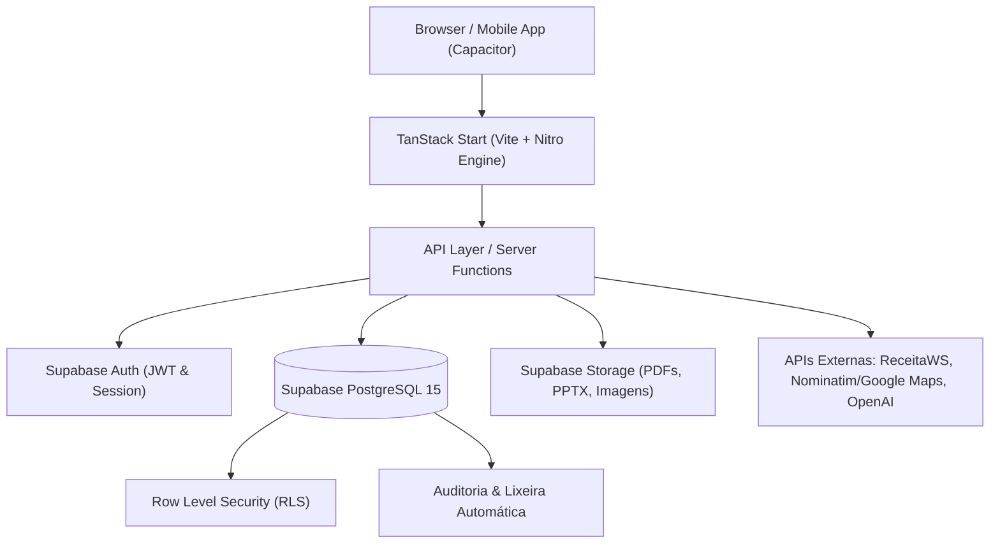
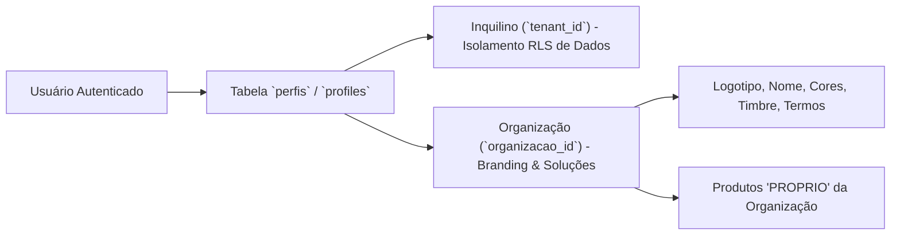
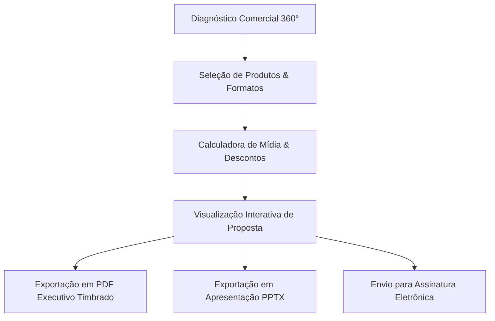

# 📚 Documentação Técnica e Operacional Completa — Mídia.OS

> **Versão do Sistema:** 2.6 (Produção Enterprise)  
> **Arquitetura:** Multi-Tenant Omnichannel & White-Label Nativo  
> **Stack:** TanStack Start (SSR / Nitro / Vite) + React 19 + TypeScript + Supabase (PostgreSQL 15)  
> **Última Atualização:** Outubro de 2026  
> **Mantenedor Principal:** Rafael Rodrigo (`Rafaelrodrigo.as@gmail.com`)

---

## 📑 Índice Geral

1. [Visão Geral & Proposta de Valor](#1-visão-geral--proposta-de-valor)
2. [Arquitetura de Software & Stack Tecnológica](#2-arquitetura-de-software--stack-tecnológica)
3. [Arquitetura Multi-Tenant & White-Label Dinâmico](#3-arquitetura-multi-tenant--white-label-dinâmico)
4. [Módulos Funcionais e Regras de Negócio](#4-módulos-funcionais-e-regras-de-negócio)
   - [4.1. Planejamento 360° & Radar de Expansão Regional (DF)](#41-planejamento-360-e-radar-de-expansão-regional-df)
   - [4.2. Inventário de Mídia & Geolocalização (OOH / DOOH)](#42-inventário-de-mídia--geolocalização-ooh--dooh)
   - [4.3. Catálogo Comercial: Soluções Próprias vs. Parceiros](#43-catálogo-comercial-soluções-próprias-vs-parceiros)
   - [4.4. Propostas Comerciais & Apresentações Executivas (PDF/PPTX)](#44-propostas-comerciais--apresentações-executivas-pdfpptx)
   - [4.5. Pedidos de Inserção (PIs), Opec e Fluxo de Aprovação](#45-pedidos-de-inserção-pis-opec-e-fluxo-de-aprovação)
   - [4.6. Central de Assinaturas Digitais & Portal do Signatário](#46-central-de-assinaturas-digitais--portal-do-signatário)
   - [4.7. Operações, Checking & Histórico de Veiculação](#47-operações-checking--histórico-de-veiculação)
   - [4.8. Gestão Financeira, Splits de Comissão & Permutas](#48-gestão-financeira-splits-de-comissão--permutas)
   - [4.9. CRM Comercial, Clientes, Agências e Tarefas](#49-crm-comercial-clientes-agências-e-tarefas)
   - [4.10. Social Media & Planejamento de Conteúdo](#410-social-media--planejamento-de-conteúdo)
   - [4.11. Landing Pages Builder](#411-landing-pages-builder)
5. [Segurança, Auditoria e Guardrails de Produção](#5-segurança-auditoria-e-guardrails-de-produção)
   - [5.1. Política de Zero Perda de Dados](#51-política-de-zero-perda-de-dados)
   - [5.2. Row Level Security (RLS) e Isolamento de Inquilinos](#52-row-level-security-rls-e-isolamento-de-inquilinos)
   - [5.3. Trilha de Auditoria e Lixeira Automática](#53-trilha-de-auditoria-e-lixeira-automática)
6. [Estrutura do Projeto & Guia do Desenvolvedor](#6-estrutura-do-projeto--guia-do-desenvolvedor)
7. [Deploy, Build Rápido e Operações Cloud](#7-deploy-build-rápido-e-operações-cloud)
8. [Suporte e Contatos](#8-suporte-e-contatos)

---

## 1. Visão Geral & Proposta de Valor

O **Mídia.OS** é uma plataforma integrada de governança, vendas, operações e inteligência comercial para empresas do ecossistema de publicidade e comunicação. Projetado originalmente para emissoras de televisão, o sistema evoluiu para uma infraestrutura **omnichannel** capaz de orquestrar simultaneamente:

- **Mídia Eletrônica Tradicional**: Emissoras de TV aberta e fechada, rádios AM/FM e canais segmentados.
- **Mídia Exterior (OOH & DOOH)**: Painéis de LED em empenas e vias públicas, mobiliário urbano, abrigos de ônibus, telas de elevadores, frontlights e outdoors com geocodificação em mapas interativos.
- **Mídia Digital & Performance**: Portais de notícias, portais verticais, branded content, banners IAB e campanhas digitais.
- **Criadores & Influenciadores**: Curadoria de talentos, agenciamento, tabelas de cachês e formatos (Reels, Stories, Feeds, Presença VIP).
- **Projetos Especiais & Eventos**: Patrocínios de eventos corporativos, eventos culturais, naming rights e ações experienciais.

### Principais Benefícios:
1. **Unificação do Ciclo de Vendas (End-to-End)**: Do diagnóstico comercial na reunião com o cliente até a emissão do PI, veiculação, checking com fotos/vídeos e liquidação financeira.
2. **Eliminação de Retrabalho com IA**: Parser inteligente de Mídia Kits em PDF/Excel e extração automatizada de dados de PIs emitidos por agências.
3. **Agilidade em Reuniões com Clientes**: Diagnóstico comercial 360° em tempo real que analisa o público-alvo, sugere canais e recomenda rotas de transbordo caso a região desejada não possua inventário cadastrado.
4. **Governança Multi-Tenant com White-Label**: Suporte a organizações filiadas ou marcas próprias (como a *Nexo Mídia e Representação*), exibindo identidade visual exclusiva e isolando produtos estratégicos.

---

## 2. Arquitetura de Software & Stack Tecnológica

O sistema é construído sobre uma arquitetura moderna, altamente tipada e de alta performance:



### Tecnologias Utilizadas:

| Camada | Tecnologia | Finalidade |
| :--- | :--- | :--- |
| **Framework Web** | TanStack Start + Nitro | SSR ultrarrápido, rotas tipadas baseadas em arquivos e funções de servidor seguras. |
| **Biblioteca UI** | React 19 + TypeScript | Interface de usuário componentizada, reativa e totalmente tipada. |
| **Estilização** | TailwindCSS + Radix UI (shadcn/ui) | Design system moderno, com suporte a temas dinâmicos (Dark/Light) e alta acessibilidade. |
| **Estado & Cache** | TanStack Query v5 (React Query) | Cache de requisições, invalidação granular, pré-carregamento e otimistic updates. |
| **Banco de Dados** | PostgreSQL 15 (Supabase) | Banco relacional robusto com extensões JSONB, índices geoespaciais e RLS rigoroso. |
| **Autenticação** | Supabase Auth + JWT | Sessões seguras, persistência local e impersonate auditável para administradores. |
| **Assinatura Digital** | Web Crypto API + HTML5 Canvas | Carimbo de tempo, IP, User-Agent e hash SHA-256 com validade jurídica (MP 2.200-2/2001). |
| **Apresentações** | PptxGenJS + jsPDF | Geração cliente/servidor de propostas executivas em PDF e slides de PowerPoint (.pptx). |
| **Mobile** | Capacitor | Empacotamento nativo híbrido para Android e iOS a partir da mesma base de código. |

---

## 3. Arquitetura Multi-Tenant & White-Label Dinâmico

O Mídia.OS implementa uma arquitetura **multi-tenant e white-label em dois níveis integrados**:



### 1. Inquilino (`tenant_id`):
- Garante o **particionamento de dados no banco de dados** por meio de políticas de Row Level Security (RLS).
- Usuários de uma emissora ou agência "A" jamais visualizam clientes, propostas ou relatórios do inquilino "B".
- Um gatilho automático no banco injeta o `tenant_id` da sessão em todas as operações de `INSERT`.

### 2. Organização / White-Label (`organizacoes`):
- Controla a **identidade corporativa e apresentação executiva** da plataforma.
- Tabela `public.organizacoes` armazena:
  - `nome`: Nome institucional (ex: *Nexo Mídia e Representação*).
  - `slug`: Identificador único (ex: `'nexo'`).
  - `logo_url`: Logotipo de alta resolução para menus e timbragem.
  - `site_url`: Endereço web oficial.
  - `tagline`: Slogan comercial de apresentação.
  - `cor_primaria`: Cor hexadecimal de destaque.
  - `termos_proposta`: Texto contratual padrão inserido nas propostas e PIs.

### 3. Isolamento de Produtos Próprios vs. Parceiros:
- A tabela `produtos` possui o campo `origem_produto` (`'PROPRIO'` ou `'PARCEIRO'`).
- **Produtos Próprios (`PROPRIO`)**: Aparecem exclusivamente para os usuários vinculados à organização dona do produto (`organizacao_id`). Se um produto pertencer à *Nexo*, outras organizações não têm acesso a ele.
- **Produtos de Parceiros (`PARCEIRO`)**: Podem ser comercializados amplamente através dos hubs de mídia parceiros.

### 4. Hook Centralizador: `useCurrentOrg()`
Localizado em `src/hooks/use-current-org.ts`, o hook provê a qualquer tela do sistema:
- `org`: Objeto com todas as propriedades da organização ativa.
- `isNexo`: Booleano facilitador para ativação de regras e design da *Nexo Mídia*.
- `branding`: Objeto contendo nome, logo, tagline, termos contratuais e links formatados.

---

## 4. Módulos Funcionais e Regras de Negócio

### 4.1. Planejamento 360° & Radar de Expansão Regional (DF)

O módulo de Planejamento 360° (`src/lib/planejamento-360.functions.ts` e interfaces associadas) foi desenvolvido para empoderar o executivo de contas durante reuniões comerciais estratégicas.

#### 1. Diagnóstico Comercial ao Vivo:
Permite selecionar parâmetros do cliente na hora da reunião:
- **Região do Desafio**: Seleção de qualquer uma das **35 Regiões Administrativas do Distrito Federal** (ex: Plano Piloto, Taguatinga, Águas Claras, Ceilândia, Samambaia, Lago Sul, etc.).
- **Perfil do Público-Alvo**:
  - Classes Sociais: *Classe A/B*, *Classe B/C*, *Classe C/D*.
  - Estilo de Vida: *Famílias/Moradores Locais*, *Executivos/Tomadores de Decisão*, *Estudantes/Jovens*, *Consumidores de Varejo/Serviços*, *Servidores Públicos/Políticos*.
  - Dores Comerciais: *Lançamento de Marca*, *Fluxo em Ponto de Venda*, *Autoridade Institucional*, *Conversão Digital*, *Cobertura Geográfica Rápida*.

#### 2. Os 5 Pilares Integrados de Mídia:
O algoritmo analisa o inventário disponível e orquestra um mix harmônico de 5 canais:
1. **OOH / DOOH (Mídia Exterior)**: Painéis de LED e telas estratégicas nos pontos de fluxo do público escolhido.
2. **TV & Rádio (Mídia de Massa & Confiança)**: Programas e emissoras com perfil alinhado à classe socioeconômica.
3. **Digital & Portais (Hipersegmentação)**: Banners e branded content em portais locais e veículos segmentados.
4. **Influenciadores & Criadores (Humanização & Engajamento)**: Criadores de conteúdo que dialogam com a persona do cliente.
5. **Projetos Especiais & Merchandising (Experiência & Naming Rights)**: Ativações presenciais e patrocínios de impacto.

#### 3. Radar de Expansão & Rotas de Transbordo:
Quando a Região Administrativa solicitada ainda não possui pontos de parceiros cadastrados:
- O sistema **não exibe tela em branco**.
- O **Radar de Expansão Regional** entra em ação:
  - Mapeia as **vias estruturantes e eixos troncais de circulação** que conectam aquela região aos grandes polos do DF (ex: *EPTG, Estrada Parque Estrutural, Pistão Sul/Norte, Avenida Comercial, Eixo Rodoviário Norte/Sul, EPTG Km 4, EPNB, DF-001*).
  - Sugere pontos de impacto em rotas de deslocamento diário daquela população (pêndulo casa-trabalho).
  - Gera um card de **"Oportunidade de Prospecção"** para o time de expansão cadastrar novos parceiros na RA solicitada.

---

### 4.2. Inventário de Mídia & Geolocalização (OOH / DOOH)

O módulo de inventário foi aprimorado para suportar georreferenciamento de alta precisão para mídia exterior:

#### 1. Estrutura de Dados do Inventário (`inventario_midia`):
- `latitude` (`NUMERIC(10, 7)`) e `longitude` (`NUMERIC(10, 7)`): Coordenadas decimais de satélite.
- `link_maps` (`TEXT`): URL direta para abertura no Google Maps ou Waze.
- `sentido_via` (`TEXT`): Fluxo do tráfego visualizado (ex: *Sentido Plano Piloto*, *Sentido Taguatinga/Ceilândia*).
- `ponto_referencia` (`TEXT`): Descrição do marco geográfico (ex: *Em frente ao Taguatinga Shopping*, *Viaduto Israel Pinheiro*).
- `resolucao_pixels`: Dimensões em pixels para veiculação técnica (ex: `1920x1080`, `768x432`).
- `insercoes_hora` e `insercoes_dia`: Capacidade e repetição de loops do painel de LED.
- `impacto_estimado`: Média diária de pessoas impactadas (estimativa de tráfego de pedestres e veículos).

#### 2. Parser Inteligente com Geocodificação Automática:
Ao importar PDFs de Mídia Kits de parceiros ou planilhas de inventário:
- Extrai automaticamente URLs do Google Maps (`maps.google.com/?q=...` ou links encurtados `goo.gl/maps/...`).
- Reconhece coordenadas decimais puras no corpo do texto.
- Se houver apenas o endereço descritivo, o parser utiliza geocodificação textual para identificar as coordenadas de referência.

#### 3. Interação Visual e Google Street View:
Na listagem do inventário e na visualização de propostas comerciais:
- Marcador no mapa dinâmico centralizado no Distrito Federal / Brasil.
- Botão direto para **"Abrir no Google Street View"**, permitindo que o cliente e o executivo vejam exatamente o ângulo visual do painel de LED ou outdoor da perspectiva do motorista.

---

### 4.3. Catálogo Comercial: Soluções Próprias vs. Parceiros

Localizado em `/produtos`, o catálogo comercial permite gerenciar toda a grade de ofertas da empresa:
- **Origem do Produto**:
  - `PROPRIO`: Criado e operado internamente pelo time da organização (ex: painéis exclusivos ou programas com cotas proprietárias).
  - `PARCEIRO`: Comercializado através de convênio com parceiros homologados.
- **Tabelas de Segundagem**: Preços flexíveis por tempo de exibição (15s, 30s, 45s, 60s ou rotativo contínuo).
- **Descontos por Volume**: Regras automáticas de abatimento progressivo para contratos de maior investimento.

---

### 4.4. Propostas Comerciais & Apresentações Executivas (PDF/PPTX)

O módulo de propostas (`/propostas`) transforma o inventário em apresentações de alto impacto estético e precisão financeira:



#### 1. Formato Simplificado para DOOH / Painéis de LED:
Para clientes de mídia exterior que exigem clareza imediata sobre a veiculação:
- Resumo com: **Inserções diárias**, **Total de inserções no mês**, **Impacto mensal estimado de pessoas** e **Investimento líquido por ponto**.
- Grid elegante com as miniaturas dos painéis, foto do local, mapa e especificações técnicas de resolução de arquivo (MP4/H.264).

#### 2. Timbragem Dinâmica & White-Label:
O gerador de apresentações (`src/lib/proposta-presentation.ts`) insere automaticamente:
- Cabeçalho timbrado com logotipo oficial da organização ativa (ex: *Nexo Mídia e Representação*).
- Tagline institucional e endereço do site oficial no rodapé de cada lâmina.
- Termos de proposta personalizados de acordo com a organização do usuário logado.

---

### 4.5. Pedidos de Inserção (PIs), Opec e Fluxo de Aprovação

O Pedido de Inserção é o documento contratual que autoriza formalmente a veiculação:

1. **Geração Automática a partir da Proposta**: Quando uma proposta comercial é aprovada ou assinada pelo cliente, o PI é gerado com um clique, herdando produtos, valores, datas de veiculação e dados de faturamento.
2. **Importação Inteligente de PIs em PDF via IA**:
   - Desenvolvida para emissoras e agências que recebem PIs de terceiros em PDF.
   - O motor de inteligência artificial lê o documento, identifica Razão Social, CNPJ, Agência, Período de Veiculação, Produtos, Quantidade de Inserções e Valores, preenchendo o formulário automaticamente.
3. **Fluxo de Aprovação Multi-Nível**:
   - `Executivo` elabora o PI.
   - `Gerente Comercial` revisa margens, descontos e comissões.
   - `Diretoria / Financeiro` concede a aprovação final para envio à Opec e programação.
4. **Link Seguro de Aprovação pela Diretoria**:
   - Disponível em `/aprovar-diretoria/$token`, permite aprovação instantânea via smartphone sem necessidade de login complexo.

---

### 4.6. Central de Assinaturas Digitais & Portal do Signatário

O Mídia.OS possui uma solução de assinatura eletrônica nativa, sem necessidade de provedores externos caros:

- **Rota do Portal**: `/assinar/$token` (acesso público criptografado via UUID/token seguro).
- **Recursos do Portal do Signatário**:
  - Leitura integral do contrato ou PI em tela responsiva.
  - Campo de assinatura interativa com suporte a desenho em tela touch (smartphones/tablets) ou mouse.
  - Opção de aceite eletrônico com nome completo, CPF e confirmação por SMS/E-mail.
  - Registro de auditoria forense: IP do signatário, geolocalização aproximada, data/hora em UTC, User-Agent do navegador e hash criptográfico SHA-256 do documento.
- **Validade Jurídica**: Total conformidade com a MP nº 2.200-2/2001 e Lei nº 14.063/2020 (Assinatura Eletrônica Avançada).

---

### 4.7. Operações, Checking & Histórico de Veiculação

Garante transparência absoluta entre o veículo/hub e o anunciante:
- **Checking Fotográfico e em Vídeo**: Upload de evidências fotográficas dos painéis de LED acesos na rua ou gravações de blocos de comerciais de TV/rádio.
- **Portal de Pós-Venda (`/pos-venda/$token`)**: Link seguro enviado ao cliente com o relatório completo de veiculações comprovadas, mapas de calor e dados de audiência/impacto.

---

### 4.8. Gestão Financeira, Splits de Comissão & Permutas

- **Contas a Receber e a Pagar**: Alimentadas em tempo real a partir dos PIs aprovados.
- **Divisão de Comissões (Splits)**:
  - Cálculo automático do BV de agência (padrão 20%, ajustável).
  - Comissões escalonadas por executivo de contas com base nas metas batidas.
- **Módulo de Permuta Comercial (`/permuta`)**:
  - Lançamento de créditos e débitos de permutas de mídia.
  - Extrato analítico por parceiro com controle de contrapartidas contratuais e saldo em moeda corrente.

---

### 4.9. CRM Comercial, Clientes, Agências e Tarefas

- **Funil Visual (Kanban)**: Etapas de *Prospecção* → *Qualificação* → *Proposta Apresentada* → *Negociação* → *Fechado (Ganho)* → *Perdido*.
- **Consulta CNPJ em Tempo Real**: Digitando o CNPJ, o sistema busca Razão Social, Nome Fantasia, CNAE, Endereço e Quadro Societário na base oficial da Receita Federal.
- **Central de Tarefas (`/tarefas`)**: Agendamento de follow-ups comerciais com alertas no sino de notificações do topo da aplicação.

---

### 4.10. Social Media & Planejamento de Conteúdo

Módulo especializado em `/social-media` para equipes de marketing e redes sociais:
- Calendário editorial visual de publicações.
- Status do post (*Ideia*, *Redação*, *Design*, *Aprovação pelo Cliente*, *Agendado*, *Publicado*).
- Formatos suportados: Reels, Carrossel, Story, Feed e Artigo.

---

### 4.11. Landing Pages Builder

Em `/landing-pages`:
- Criação rápida de páginas de captura focadas em campanhas específicas de clientes ou vendas de pacotes de mídia do próprio veículo.
- Rotas públicas automáticas em `/lp/$slug`.
- Captura de formulários conectada diretamente ao funil do CRM.

---

## 5. Segurança, Auditoria e Guardrails de Produção

### 5.1. Política de Zero Perda de Dados

O sistema opera em ambiente crítico de produção sob as seguintes regras invioláveis:
1. **É estritamente proibido rodar scripts destrutivos** (`DROP TABLE`, `DROP COLUMN`, `TRUNCATE` ou `DELETE` sem restrições explícitas de chave primária e tenant).
2. **Evolução de Esquema Aditiva**: Todas as migrações em `supabase/migrations/` utilizam `IF NOT EXISTS`, defaults seguros e preservam colunas históricas.
3. **Prevenção de Exclusão em Massa**: Triggers no PostgreSQL bloqueiam comandos `DELETE` que afetem mais de 10 registros simultaneamente sem uma flag de autorização temporária de sessão.

### 5.2. Row Level Security (RLS) e Isolamento de Inquilinos

Todas as tabelas de negócio possuem RLS ativo:
```sql
ALTER TABLE public.produtos ENABLE ROW LEVEL SECURITY;
ALTER TABLE public.propostas ENABLE ROW LEVEL SECURITY;
ALTER TABLE public.pedidos_insercao ENABLE ROW LEVEL SECURITY;
```
As consultas são isoladas pela verificação da sessão JWT do usuário através da função:
```sql
auth.uid() = user_id AND tenant_id = current_setting('app.current_tenant_id', true)::uuid
```

### 5.3. Trilha de Auditoria e Lixeira Automática

- **Auditoria Universal (`auditoria_alteracoes`)**: Qualquer `INSERT`, `UPDATE` ou `DELETE` em tabelas comerciais grava automaticamente:
  - ID do registro modificado.
  - Tabela afetada.
  - Snapshot completo do estado anterior (`dados_anteriores` em JSONB).
  - Snapshot completo do novo estado (`dados_novos` em JSONB).
  - Usuário responsável e timestamp.
- **Lixeira Automática (`trash_items`)**:
  - Exclusões efetuadas por usuários não apagam linhas de tabelas críticas; elas realizam soft-delete ou arquivam o registro em `trash_items`.
  - Itens na lixeira podem ser restaurados com integridade referencial em até 45 dias por usuários com perfil `admin`.

---

## 6. Estrutura do Projeto & Guia do Desenvolvedor

```text
tvbrasilia-main/
├── src/
│   ├── components/                 # Componentes de interface (UI / Radix / Layout)
│   │   ├── AppShell.tsx            # Shell principal, sidebar e menu superior com White-label
│   │   ├── VisualizarPropostaDialog.tsx # Apresentação executiva de propostas
│   │   ├── ui/                     # Primitivos shadcn/ui (Button, Card, Dialog, etc.)
│   ├── hooks/                      # Hooks customizados do React
│   │   ├── use-current-org.ts      # Hook global de organização e white-label
│   │   ├── use-tenant-modulos.ts   # Verificação de módulos contratados
│   │   ├── use-roles.ts            # RBAC (admin, executivo, parceiro)
│   ├── lib/                        # Regras de negócio, serviços e funções de servidor
│   │   ├── organizacoes.functions.ts # Funções de banco e cache de organizações
│   │   ├── planejamento-360.functions.ts # Motor de IA, 35 RAs do DF e Radar de Expansão
│   │   ├── proposta-presentation.ts # Gerador de apresentações PPTX e PDFs timbrados
│   │   ├── produtos.functions.ts   # Gestão de produtos próprios vs parceiros
│   │   ├── supabase.ts             # Cliente de conexão Supabase
│   ├── routes/                     # Rotas baseadas em arquivo (TanStack Start)
│   │   ├── __root.tsx              # Raiz da aplicação e provedores globais
│   │   ├── index.tsx               # Dashboard comercial
│   │   ├── crm.tsx                 # Funil de vendas (Kanban)
│   │   ├── produtos.tsx            # Catálogo comercial
│   │   ├── propostas.tsx           # Construtor e gestão de propostas
│   │   ├── pi.tsx                  # Gestão de Pedidos de Inserção
│   │   ├── financeiro.tsx          # Gestão financeira e faturamento
│   │   ├── documentacao.tsx        # Manual interativo dentro do app
│   │   ├── assinar.$token.tsx      # Portal público de assinaturas eletrônicas
├── supabase/
│   ├── migrations/                 # Migrações SQL versionadas e não-destrutivas
├── scripts/                        # Scripts de automação, build e deploy
│   ├── build-quick.mjs             # Compilação rápida de produção
│   ├── sync-hostinger-all.mjs      # Sincronização via FTP/SSH com Hostinger
├── tests/                          # Suítes de testes unitários e de integração
└── package.json                    # Dependências do ecossistema Node.js
```

---

## 7. Deploy, Build Rápido e Operações Cloud

### 1. Executando Localmente em Modo Desenvolvimento:
```bash
npm install
npm run dev
```
O servidor de desenvolvimento estará disponível em `http://localhost:3000`.

### 2. Executando Testes de Regressão e Validação:
```bash
node tests/testar-whitelabel-organizacoes.mjs
node tests/testar-geolocalizacao-ooh.mjs
node --experimental-strip-types tests/testar-planejamento-360-radar.mjs
```

### 3. Build Rápido de Produção:
Para evitar compilações demoradas que travam em máquinas de desenvolvimento:
```bash
node scripts/build-quick.mjs
```
O comando compila o frontend e o servidor Nitro na pasta `.output/` em menos de 70 segundos.

### 4. Deploy Automatizado para Produção (Hostinger):
O script de sincronização faz o upload otimizado dos arquivos alterados:
```bash
node scripts/sync-hostinger-all.mjs
```

---

## 8. Suporte e Contatos

Para suporte técnico de infraestrutura, solicitações de novas funcionalidades ou esclarecimento sobre regras de negócio:

- **Engenheiro Líder / Arquiteto do Sistema**: Rafael Rodrigo
- **E-mail de Suporte**: `Rafaelrodrigo.as@gmail.com`
- **Telefone / WhatsApp Comercial**: `(61) 98474-6857`
- **Organização Pioneira**: *Nexo Mídia e Representação* (`https://nexomidiaerepresentacao.com.br`)

---
*Mídia.OS — O Sistema Operacional definitivo para o ecossistema de publicidade e mídia.*
